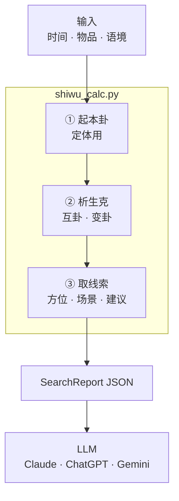
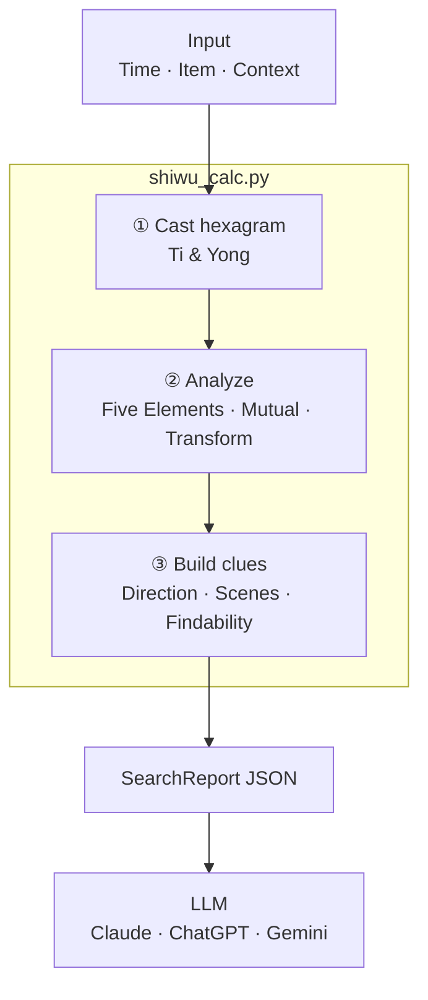

# Dowsing · 失物占

> **AI Agent Skill** — Lost-item search powered by [Meihua Yishu](https://en.wikipedia.org/wiki/Plum_Blossom_Yijing) (梅花易数). Works with **Claude Code**, **Cursor**, **ChatGPT** & **Gemini**.

[Agent Skill](https://github.com/anthropics/skills)
[Claude Code]()
[Cursor Skill]()
[License: MIT](./LICENSE)

**A structured search heuristic — not magic, but a systematic way to break through search blind spots.**

**梅花易数失物占 · 结构化搜索启发器 — 帮你打破搜寻盲区，而非预定命运。**

## Quick Install · 一键安装

**Repo:** https://github.com/raphaelxie/dowsing

### Option A — One command (Claude + Cursor)

```bash
curl -fsSL https://raw.githubusercontent.com/raphaelxie/dowsing/main/scripts/install.sh | bash
```

Or from a local clone:

```bash
bash scripts/install.sh all    # both agents
bash scripts/install.sh claude # Claude Code only
bash scripts/install.sh cursor # Cursor only
```

### Option B — Manual clone

```bash
# Claude Code
git clone https://github.com/raphaelxie/dowsing.git ~/.claude/skills/dowsing
pip install -r ~/.claude/skills/dowsing/requirements.txt

# Cursor
git clone https://github.com/raphaelxie/dowsing.git ~/.cursor/skills/dowsing
pip install -r ~/.cursor/skills/dowsing/requirements.txt
```

Or in Claude Code: `Please install this skill: https://github.com/raphaelxie/dowsing`

**Triggers:** `失物占` · `找东西` · `lost item` · `I lost my passport` · `我的 XX 丢了`

[中文](#中文) · [English](#english)

---

## 中文

### 概述

**Dowsing（失物占）** 是基于[梅花易数](https://zh.wikipedia.org/wiki/梅花易数)的确定性占卜工具，帮助你系统化地搜寻丢失的物品：

- **方位线索** — 跨语境最稳定的信号，源自后天八卦方位
- **场景联想** — 根据丢失环境（居家/公共场所/交通工具/走失宠物）提供不同类象
- **能否找回判断** — 通过体用五行生克分析
- **排序搜索清单** — 提供优先级排序的搜索区域，而非单一猜测
- **移动推断** — 判断物品是否已被移动，以及可能的去向

> **这不是「算命」。** 这是一个**结构化搜索启发器**——用系统化的方式引导你去检查那些还没找过的地方。把它看作搜索的指南针，而非预言的水晶球。

### 为什么要区分语境？

梅花易数「理大于象」——同一个卦，在不同环境中取不同的象。坎卦（☵）代表「近水处」：在家意味着洗衣机或卫生间；在公共场所则是河流、水沟、地下空间。不知道丢失场景，解释就会误入歧途。而**方位**（后天八卦）不随场景变化，因此被提升为首要判断依据。

### 安装

#### Claude Code / Cursor（推荐）

```bash
curl -fsSL https://raw.githubusercontent.com/raphaelxie/dowsing/main/scripts/install.sh | bash
```

或手动 clone 到对应目录，并安装 Python 依赖（见 README 顶部 Quick Install）。

或在 Claude Code 中直接说：

```
请安装这个 skill：https://github.com/raphaelxie/dowsing
```

安装后，「我的护照丢了」「失物占」「找东西」「lost item」等触发词即可激活。

#### 作为 ChatGPT Custom GPT

1. 前往 [https://chatgpt.com/gpts/editor](https://chatgpt.com/gpts/editor) 创建新 GPT
2. 将 `SKILL.md` 全文复制到 **Instructions**（需 < 8000 字符）
3. 上传 `references/` 下全部文件为 **Knowledge**
4. 建议对话开场白：「我的东西丢了，帮我占一卦」「失物占」

#### 作为 Google Gemini Gem

1. 前往 [https://gemini.google.com/gems](https://gemini.google.com/gems) 创建新 Gem
2. 将 `SKILL.md` 复制到 Instructions
3. 上传 `references/` 为 Knowledge 文件
4. 建议提示：「失物占」「帮我找丢失的东西」

#### 命令行 / 作为库使用

```bash
# 安装依赖
pip install -r requirements.txt

# 当前时间起卦
python scripts/shiwu_calc.py time --item 护照 --context home

# 公历时间起卦
python scripts/shiwu_calc.py gregorian 2026 6 17 14 --item 充电线 --context public

# 数字起卦（报 2～3 个数字）
python scripts/shiwu_calc.py num 1 6 1 --item 金手链 --context home

# 走失宠物
python scripts/shiwu_calc.py time --item 猫 --context pet
```

脚本输出结构化 JSON **SearchReport**，包含 `primary_direction`（首要方位）、`locations`（搜索区）、`findability`（能否找回）、`action_advice`（下一步建议）等字段。

### 语境取值


| 值         | 中文标签    | 适用场景              |
| --------- | ------- | ----------------- |
| `home`    | 居家      | 在家中丢失             |
| `public`  | 公共场所/户外 | 图书馆、学校、办公室、商场、街道等 |
| `transit` | 交通工具    | 飞机、大巴、火车、汽车、地铁等   |
| `pet`     | 走失生物    | 走失的猫、狗等宠物         |
| `general` | 通用      | 不确定语境时的默认值，侧重方位   |


### 工作原理



**引擎步骤（`shiwu_calc.py` 内部）：**

1. 据输入起本卦
2. 定体（失主）用（失物）
3. 分析五行生克关系
4. 推互卦 — 中间经过路径
5. 推变卦 — 是否移动
6. 提取方位 + 依语境取场景类象
7. 计算复合方向（如南+西=西南）
8. 生成寻回倾向判断
9. 构建行动建议

**SearchReport 字段：** `primary_direction` · `locations[]` · `findability` · `moved` · `action_advice`

### 项目结构

```
dowsing/
├── SKILL.md                      # AI Skill 主文档
├── README.md                     # 本文件
├── requirements.txt              # Python 依赖（lunardate）
├── scripts/
│   └── shiwu_calc.py             # 确定性失物占起卦引擎
├── references/
│   ├── bagua-shiwu.md            # 八卦后天方位 + 依语境的失物类象
│   ├── tiyong-shiwu.md           # 体用生克断法
│   └── cases.md                  # 验证案例
└── tests/
    └── test_shiwu.py             # 回归测试
```

### 八卦速览


| 卦序  | 卦名  | 符号  | 五行  | 后天方位 | 关键特征         |
| --- | --- | --- | --- | ---- | ------------ |
| 1   | 乾   | ☰   | 金   | 西北   | 圆形、金属、高处     |
| 2   | 兑   | ☱   | 金   | 西    | 缺口、小金属器具、饮食处 |
| 3   | 离   | ☲   | 火   | 南    | 明亮、文书、电器     |
| 4   | 震   | ☳   | 木   | 东    | 木器、动处、喧闹处    |
| 5   | 巽   | ☴   | 木   | 东南   | 柔软织物、缝隙、通风口  |
| 6   | 坎   | ☵   | 水   | 北    | 近水、隐蔽暗格、洗涤处  |
| 7   | 艮   | ☶   | 土   | 东北   | 角落、静止处、门径台阶  |
| 8   | 坤   | ☷   | 土   | 西南   | 低处、布料、包内、口袋  |


### 能否找回（体用生克）


| 生克关系 | 倾向  | 距离  | 说明           |
| ---- | --- | --- | ------------ |
| 用生体  | 易得  | 近   | 失物「自来」，多在近处  |
| 体用比和 | 易得  | 近   | 同气相求，原处附近    |
| 体克用  | 可得  | 中   | 需主动寻找，费力但能找回 |
| 用克体  | 难寻  | 远   | 恐已离身或被他人取走   |
| 体生用  | 难得  | 远   | 耗神费力，多半难找回   |


### 运行测试

```bash
pip install -r requirements.txt
pip install pytest
pytest tests/ -v
```

### 验证案例


| 案例        | 语境  | 关键启示                            |
| --------- | --- | ------------------------------- |
| 金手链 → 洗衣机 | 居家  | 坎卦（☵）=「在水里」→ 在洗衣机中找到            |
| 充电线在图书馆   | 公共  | 艮卦（☶）= 公共场所对应「失物招领处」            |
| 充电宝落飞机    | 交通  | 语境决定取象——交通工具场景完全不同于居家           |
| SIM卡在包内夹层 | 居家  | 复合方向：离（南）+ 兑（西）= 西南（坤），在西南方包内寻得 |
| 走失猫咪      | 宠物  | 方位 + 动物类象 + 是否自归分析              |


详见 `references/cases.md`。

### 设计原则

1. **理大于象** — 语境决定场景取象，绝不默认「在家」
2. **方位优先** — 后天八卦方位是跨语境最稳定的线索，先报方位再报场景
3. **措辞谦逊** — 用「倾向」「可能」「建议先查」，不用「一定」「绝对」
4. **不作应期** — MVP 不推断时间，不编造「几天后找到」
5. **策略必出** — 每次必须给出具体的【下一步】行动建议

### 伦理声明

- 吉凶并陈，不偏颇粉饰
- 不预测死亡、极端不幸或灾难性损失
- 不替代报警——贵重物品遗失建议同时报警
- 强调结果的**参考性质**，鼓励用户结合实际情况判断
- 心理脆弱者格外强调「搜索启发」定位
- 这是搜索的指南针，不是命运的判决书——它指引你去还没找过的地方

### 参与贡献

欢迎贡献，尤其需要：

- 有 ground truth 的新验证案例
- 改进各语境下的类象场景
- 参考资料的各语言翻译
- Bug 报告与测试覆盖提升

### 许可

[MIT](./LICENSE)

---

## English

### Overview

**Dowsing** (失物占, *Lost Item Divination*) is a deterministic divination tool based on [Meihua Yishu](https://en.wikipedia.org/wiki/Plum_Blossom_Yijing) (梅花易数, Plum Blossom Yi-ology). It helps you search for lost items by providing:

- **Directional clues** — the most stable cross-context signal, derived from Hou Tian Bagua (后天八卦) bearings
- **Context-aware scene suggestions** — tailored to where the item was lost (home, public, transit, or a lost pet)
- **Findability assessment** — via Ti-Yong (体用) Five Elements analysis
- **Ranked search checklist** — prioritized locations to check, not a single guess
- **Movement inference** — whether the item has likely been moved, and where to

> **It is NOT fortune-telling.** It is a **structured search heuristic**: a systematic way to guide you toward places you haven't checked yet. Think of it as a compass for your search, not a crystal ball.

### Why Context Matters

In Meihua Yishu, the same hexagram maps to different real-world objects depending on the environment. A Kan (坎 ☵) hexagram means "near water" — in a home that suggests the washing machine or bathroom; in a public space it suggests a river, drain, or underground area. Without context, the interpretation is useless or misleading. **Direction**, however, stays constant across all contexts, which is why it is elevated to the primary clue.

### Installation

#### Claude Code / Cursor (Recommended)

```bash
curl -fsSL https://raw.githubusercontent.com/raphaelxie/dowsing/main/scripts/install.sh | bash
```

Or clone manually — see **Quick Install** at the top of this README.

Or in Claude Code, simply say:

```
Please install this skill: https://github.com/raphaelxie/dowsing
```

Once installed, trigger phrases like "我的护照丢了" (I lost my passport), "失物占", "找东西", or "lost item" will activate the skill.

#### As a ChatGPT Custom GPT

1. Go to [https://chatgpt.com/gpts/editor](https://chatgpt.com/gpts/editor) and create a new GPT
2. Copy the full text of `SKILL.md` into **Instructions** (must be < 8000 characters)
3. Upload all files under `references/` as **Knowledge**
4. Suggested conversation starters: "我的东西丢了，帮我占一卦" / "失物占"

#### As a Google Gemini Gem

1. Go to [https://gemini.google.com/gems](https://gemini.google.com/gems) and create a new Gem
2. Copy `SKILL.md` into Instructions
3. Upload `references/` as Knowledge files
4. Suggested prompts: "失物占" / "帮我找丢失的东西"

#### CLI / Library Usage

```bash
# Install dependencies
pip install -r requirements.txt

# Cast by current time
python scripts/shiwu_calc.py time --item "passport" --context home

# Cast by Gregorian date
python scripts/shiwu_calc.py gregorian 2026 6 17 14 --item "charging cable" --context public

# Cast by numbers (2–3 numbers you have in mind)
python scripts/shiwu_calc.py num 1 6 1 --item "gold bracelet" --context home

# Lost pet
python scripts/shiwu_calc.py time --item "cat" --context pet
```

The script outputs a structured JSON **SearchReport** containing `primary_direction`, `locations`, `findability`, `action_advice`, and more.

### Context Values


| Value     | Label   | When to Use                                               |
| --------- | ------- | --------------------------------------------------------- |
| `home`    | 居家      | Item lost at home                                         |
| `public`  | 公共场所/户外 | Item lost in a library, office, mall, street, etc.        |
| `transit` | 交通工具    | Item lost on a plane, bus, train, car, etc.               |
| `pet`     | 走失生物    | A lost cat, dog, or other pet                             |
| `general` | 通用      | Unknown context — direction-only interpretation (default) |


### How It Works



**Engine steps (inside `shiwu_calc.py`):**

1. Cast hexagram (本卦) from input
2. Determine Ti (体 = seeker) & Yong (用 = item)
3. Analyze Five Elements (五行) relationship
4. Compute mutual hexagram (互卦) — transition path
5. Compute transformed hexagram (变卦) — movement
6. Extract directions + context-aware scenes
7. Compute combined directions (e.g. 南+西=西南)
8. Generate findability assessment
9. Build action advice

**SearchReport fields:** `primary_direction` · `locations[]` · `findability` · `moved` · `action_advice`

### Project Structure

```
dowsing/
├── SKILL.md                      # AI Skill main document
├── README.md                     # This file
├── requirements.txt              # Python dependencies (lunardate)
├── scripts/
│   └── shiwu_calc.py             # Deterministic divination engine
├── references/
│   ├── bagua-shiwu.md            # Bagua directions + lost-item imagery by context
│   ├── tiyong-shiwu.md           # Ti-Yong Five Elements analysis for lost items
│   └── cases.md                  # Verified case studies
└── tests/
    └── test_shiwu.py             # Regression tests
```

### The Eight Trigrams (Bagua) at a Glance


| #   | Name   | Symbol | Element   | Direction | Key Traits                            |
| --- | ------ | ------ | --------- | --------- | ------------------------------------- |
| 1   | 乾 Qián | ☰      | Metal (金) | NW 西北     | Round, metallic, high places          |
| 2   | 兌 Duì  | ☱      | Metal (金) | W 西       | Gaps, small metal items, dining areas |
| 3   | 離 Lí   | ☲      | Fire (火)  | S 南       | Bright, documents, electronics        |
| 4   | 震 Zhèn | ☳      | Wood (木)  | E 东       | Wood, movement, noisy areas           |
| 5   | 巽 Xùn  | ☴      | Wood (木)  | SE 东南     | Fabric, gaps, crevices, vents         |
| 6   | 坎 Kǎn  | ☵      | Water (水) | N 北       | Water, hidden recesses, washing       |
| 7   | 艮 Gèn  | ☶      | Earth (土) | NE 东北     | Corners, still places, thresholds     |
| 8   | 坤 Kūn  | ☷      | Earth (土) | SW 西南     | Low places, fabric, bags, pockets     |


### Findability (Ti-Yong Analysis)


| Relationship  | Tendency       | Distance | Meaning                            |
| ------------- | -------------- | -------- | ---------------------------------- |
| 用生体 Yong → Ti | Easy (易得)      | Near     | Item "comes to you"; likely nearby |
| 体用比和 Harmony  | Easy (易得)      | Near     | Same element; near original spot   |
| 体克用 Ti → Yong | Possible (可得)  | Medium   | Requires effort but recoverable    |
| 用克体 Yong → Ti | Difficult (难寻) | Far      | May have left your possession      |
| 体生用 Ti → Yong | Hard (难得)      | Far      | Draining; unlikely to recover      |


### Running Tests

```bash
pip install -r requirements.txt
pip install pytest
pytest tests/ -v
```

### Verified Cases


| Case                            | Context | Key Insight                                                         |
| ------------------------------- | ------- | ------------------------------------------------------------------- |
| Gold bracelet → washing machine | Home    | Kan hexagram (坎 ☵) = "in water" → found in washing machine          |
| Charging cable at library       | Public  | Gen hexagram (艮 ☶) = "lost & found" in public context               |
| Power bank on airplane          | Transit | Context matters — transit scenes differ from home                   |
| SIM card in bag pocket          | Home    | Combined direction: Li (S) + Dui (W) = SW (Kun), found in SW pocket |
| Lost cat                        | Pet     | Direction + animal imagery + self-return analysis                   |


See `references/cases.md` for full details.

### Design Principles

1. **Reason over image (理大于象)** — Context determines scene interpretation; never default to "at home"
2. **Direction first** — Bagua bearing is the most stable cross-context clue; report it before scenes
3. **Humble language** — Use "tendency", "likely", "suggest checking" — never "certainly" or "absolutely"
4. **No timing predictions** — MVP does not infer when you will find the item
5. **Always output next steps** — Every report must include concrete action advice

### Ethics

- Present both favorable and unfavorable outcomes; do not sugarcoat
- Do not predict death, extreme misfortune, or catastrophic loss
- Do not replace law enforcement — suggest reporting valuable lost items to police
- Emphasize the **reference nature** of results; encourage users to combine with practical knowledge
- Be especially gentle with emotionally vulnerable users; reinforce the "search heuristic" framing
- This is a search compass, not destiny — it guides you to places you haven't looked yet

### Contributing

Contributions are welcome — especially:

- New verified case studies with ground truth
- Improved context-dependent imagery (scene suggestions)
- Language translations of reference materials
- Bug reports and test coverage improvements

### License

[MIT](./LICENSE)

---

**「穷则变，变则通，通则久。」**

*"When exhausted, change; when changed, flow; when flowing, endure."*

失物占的真谛：指引你去还没找过的地方，而非预定命运。

*The essence of Dowsing: it guides you to places you haven't looked yet — it does not predestine the outcome.*

